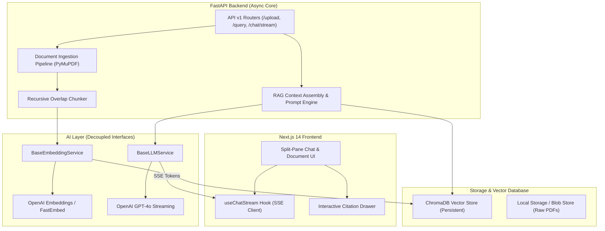

# AI Document Chat (RAG) 🚀

[](https://nextjs.org/)
[](https://fastapi.tiangolo.com/)
[](https://www.trychroma.com/)
[](https://openai.com/)
[](LICENSE)

An enterprise-ready, production-grade Full-Stack **Retrieval-Augmented Generation (RAG)** platform. Upload single or multi-document PDFs, ask natural-language questions, and receive hallucination-free, citation-grounded answers with real-time token streaming.

---

## 📑 Table of Contents
- [Overview](#-overview)
- [Key Features](#-key-features)
- [System Architecture](#-system-architecture)
- [Tech Stack](#-tech-stack)
- [Folder Structure](#-folder-structure)
- [Progress Checklist](#-progress-checklist)
- [Development Roadmap & Milestones](#-development-roadmap--milestones)
- [Quickstart & Setup](#-quickstart--setup)
- [Environment Variables](#-environment-variables)
- [Future Improvements & SaaS Evolution](#-future-improvements--saas-evolution)
- [Deployment](#-deployment)
- [Role Documentation](#-role-documentation)

---

## 🌟 Overview

Large Language Models (LLMs) suffer from domain-knowledge cutoffs and hallucinations when queried on private or proprietary data. **AI Document Chat (RAG)** solves this by coupling deep document ingestion (PyMuPDF), semantic chunking, high-dimensional vector embeddings, ChromaDB vector indexing, and GPT-4o context synthesis with strict source attribution.

This repository serves as a portfolio demonstration of clean full-stack AI engineering, separation of concerns, modular AI provider interfaces, and responsive user experience design.

---

## ✨ Key Features

- 📄 **High-Fidelity PDF Processing**: Extracts text and structural metadata per page using PyMuPDF (`fitz`), preserving context and page boundaries.
- ✂️ **Deterministic Recursive Chunking**: Dynamic character/token chunking with sliding-window overlap to eliminate boundary information loss.
- 🧠 **Modular AI Provider Architecture**: Abstract embedding and LLM provider interfaces—seamlessly switch between OpenAI (`text-embedding-3-small` / `gpt-4o`) and local models (HuggingFace FastEmbed / Ollama) with zero business logic rewrites.
- ⚡ **ChromaDB Vector Store**: Persistent local vector collection with multi-tenancy metadata filtering (`doc_id`, `page_number`, `chunk_id`).
- 🌊 **Real-Time Token Streaming**: Server-Sent Events (SSE) streaming delivering instant, low-latency conversational feedback.
- 🎯 **Grounded Citations & Inspector**: Answers cite exact document names, page numbers, and passage snippets with an interactive UI drawer.
- 📚 **Multi-Document Corpus Management**: Query across multiple active documents simultaneously or filter to a single focal text.
- 🎨 **Modern Split-Pane Workspace**: Glassmorphism dark/light interface, live document preview, chat thread, and responsive controls.
- 🐳 **1-Click Containerization**: Multi-stage Dockerfiles and `docker-compose.yml` for unified local development and production deployment.

---

## 🏛 System Architecture

### High-Level Architecture Diagram



---

## 🛠 Tech Stack

| Domain | Technology | Description |
| :--- | :--- | :--- |
| **Frontend** | [Next.js 14](https://nextjs.org/) | React framework with App Router, TypeScript, and Server Components |
| **Styling** | [Tailwind CSS](https://tailwindcss.com/) | Modern design system, CSS variables, glassmorphism dark theme |
| **Icons & UI** | [Lucide React](https://lucide.dev/) / Framer Motion | Smooth icons and micro-interactions |
| **Backend** | [FastAPI](https://fastapi.tiangolo.com/) | Async high-performance Python 3.11+ web framework |
| **PDF Extraction**| [PyMuPDF (fitz)](https://pymupdf.readthedocs.io/) | High-performance PDF parser with page-level layout awareness |
| **Vector DB** | [ChromaDB](https://www.trychroma.com/) | Persistent vector database with metadata filtering |
| **Embeddings** | OpenAI / FastEmbed | `text-embedding-3-small` with local fallback support |
| **LLM** | OpenAI GPT-4o / GPT-4o-mini | Grounded instruction prompts with SSE streaming |
| **Validation** | Pydantic v2 | Strict type and schema validation for API contracts |
| **DevOps** | Docker & Docker Compose | Containerized multi-stage builds |

---

## 📂 Folder Structure

```
AI Document Chat (RAG)/
├── .env.example                # Blueprint for environment secrets
├── .gitignore                  # Git exclusions (pycache, node_modules, vectors)
├── README.md                   # Project documentation & progress tracking
├── docker-compose.yml          # Multi-container orchestration
├── docs/                       # Engineering role guidelines
│   ├── 01_project_architect.md
│   ├── 02_code_reviewer.md
│   ├── 03_bug_fixer.md
│   ├── 04_ui_designer.md
│   ├── 05_security_auditor.md
│   └── 06_deployment_engineer.md
├── backend/                    # FastAPI Backend Service
│   ├── Dockerfile
│   ├── requirements.txt
│   ├── app/
│   │   ├── main.py             # FastAPI entrypoint & middleware
│   │   ├── core/               # Configuration & logging
│   │   │   ├── config.py
│   │   │   └── logging.py
│   │   ├── api/v1/             # REST & SSE endpoints
│   │   │   ├── api.py
│   │   │   └── endpoints/
│   │   │       ├── health.py
│   │   │       ├── documents.py
│   │   │       └── chat.py
│   │   ├── models/             # Pydantic schemas & DTOs
│   │   │   └── schemas.py
│   │   ├── interfaces/         # Decoupled AI provider abstractions
│   │   │   ├── embedding.py
│   │   │   └── llm.py
│   │   └── services/           # Business logic & pipelines
│   │       ├── pdf_service.py
│   │       ├── chunking_service.py
│   │       ├── embedding_service.py
│   │       ├── vector_store.py
│   │       ├── rag_service.py
│   │       └── citation_service.py
│   └── tests/                  # Backend unit & integration tests
└── frontend/                   # Next.js 14 Frontend Application
    ├── Dockerfile
    ├── package.json
    ├── tailwind.config.ts
    ├── tsconfig.json
    └── src/
        ├── app/                # App Router pages & layouts
        ├── components/         # UI components (Chat, Documents, Citations)
        ├── hooks/              # Custom hooks (useChatStream, useDocuments)
        ├── lib/                # API client & utility helpers
        └── types/              # TypeScript interfaces
```

---

## 📋 Progress Checklist

- [x] **Project initialization** (Phase 1)
- [x] **Frontend setup** (Phase 2)
- [x] **Backend setup** (Phase 3)
- [ ] **Authentication & Config** (Optional SaaS module)
- [x] **PDF upload** (Phase 4)
- [x] **PDF text extraction** (Phase 4)
- [x] **Text chunking** (Phase 5)
- [x] **Embeddings generation** (Phase 5)
- [x] **ChromaDB integration** (Phase 5)
- [x] **Semantic search** (Phase 6)
- [x] **RAG pipeline** (Phase 7)
- [x] **Chat interface** (Phase 2 & Phase 7)
- [x] **Streaming responses** (Phase 7)
- [x] **Citations** (Phase 8)
- [x] **Multi-document support** (Phase 9)
- [x] **Document management** (Phase 9)
- [ ] **Testing** (Phase 10)
- [ ] **Docker** (Phase 10)
- [ ] **Deployment** (Phase 10)

---

## 🗺 Development Roadmap & Milestones

| Phase | Milestone | Focus Area | Status |
| :---: | :--- | :--- | :---: |
| **01** | **Project Foundation** | Architecture, folder structure, engineering docs, README | **Completed** ✅ |
| **02** | **Frontend UI/UX** | Next.js 14, Tailwind design system, split-pane workspace, chat feed | **Completed** ✅ |
| **03** | **Backend Foundation** | FastAPI async app, Pydantic settings, health checks, CORS | **Completed** ✅ |
| **04** | **PDF Processing Engine** | File upload endpoint, PyMuPDF page extraction, metadata preservation | **Completed** ✅ |
| **05** | **Chunking & Embeddings** | Recursive chunking, OpenAI/Local embeddings, ChromaDB vector indexing | **Completed** ✅ |
| **06** | **Semantic Retrieval** | Vector similarity queries, MMR, score thresholding, chunk inspection | **Completed** ✅ |
| **07** | **RAG Pipeline & Streaming** | Grounded prompt design, GPT-4o integration, SSE streaming endpoint | **Completed** ✅ |
| **08** | **Source Citations** | Citation mapping, inline badges, source viewer highlight panel | **Completed** ✅ |
| **09** | **Multi-Document Corpus**| Cross-document retrieval, document lifecycle & vector purging | **Completed** ✅ |
| **10** | **Docker & Hardening** | Multi-stage Docker, integration tests, portfolio showcase polish | Pending ⏳ |

---

## ⚡ Quickstart & Setup

### Prerequisites
- **Node.js**: v18.17+ or v20+
- **Python**: v3.10 or v3.11+
- **OpenAI API Key** (or local model configuration)
- **Docker & Docker Compose** (optional for containerized run)

### 1. Clone & Configure Environment
```bash
git clone https://github.com/Muneeb786-hub/AI-Document-Chat-RAG.git
cd "AI-Document-Chat-RAG"
cp .env.example .env
```

### 2. Backend Setup
```bash
cd backend
python -m venv venv
source venv/bin/activate  # On Windows: venv\Scripts\activate
pip install -r requirements.txt
uvicorn app.main:app --reload --port 8000
```
*Backend API will be running at `http://localhost:8000` (Swagger UI at `http://localhost:8000/docs`).*

### 3. Frontend Setup
```bash
cd ../frontend
npm install
npm run dev
```
*Frontend will be running at `http://localhost:3002`.*

---

## 🔑 Environment Variables

See [.env.example](file:///.env.example) for the full specification:

```env
# Application Core
PROJECT_NAME="AI Document Chat (RAG)"
ENVIRONMENT=development
DEBUG=True
API_V1_STR=/api/v1

# AI Configuration
OPENAI_API_KEY=your_openai_api_key_here
OPENAI_MODEL=gpt-4o-mini
EMBEDDING_PROVIDER=openai # Options: 'openai', 'local'
EMBEDDING_MODEL=text-embedding-3-small

# Vector DB & Storage
CHROMA_PERSIST_DIRECTORY=./data/chroma_db
UPLOAD_DIRECTORY=./data/uploads
MAX_FILE_SIZE_MB=25

# CORS Settings
BACKEND_CORS_ORIGINS=["http://localhost:3000", "http://127.0.0.1:3000"]
```

---

## 🚀 Future Improvements & SaaS Evolution

- 🔐 **Multi-Tenant Authentication**: Add Supabase / Clerk auth with per-user document isolation and usage quotas.
- 📊 **Hybrid Search (BM25 + Dense Vectors)**: Integrate Reciprocal Rank Fusion (RRF) for exact keyword matches (e.g., SKU codes, financial tables).
- 🧩 **Advanced Parsers**: OCR support via Tesseract / Unstructured for scanned image-heavy PDFs.
- 📈 **RAG Evaluation**: Continuous automated evaluation using Ragas (Faithfulness, Answer Relevance, Context Precision).

---

## 🐳 Deployment

- **Containerized**: `docker-compose up --build` launches both services with unified networking.
- **Cloud Hosting**: Backend deployable to Render / Railway / AWS ECS; Frontend deployable to Vercel.

---

## 📚 Role Documentation

To ensure production-grade software craftsmanship, this project enforces the following engineering guidelines located in the `docs/` directory:
- [01_project_architect.md](file:///docs/01_project_architect.md)
- [02_code_reviewer.md](file:///docs/02_code_reviewer.md)
- [03_bug_fixer.md](file:///docs/03_bug_fixer.md)
- [04_ui_designer.md](file:///docs/04_ui_designer.md)
- [05_security_auditor.md](file:///docs/05_security_auditor.md)
- [06_deployment_engineer.md](file:///docs/06_deployment_engineer.md)
