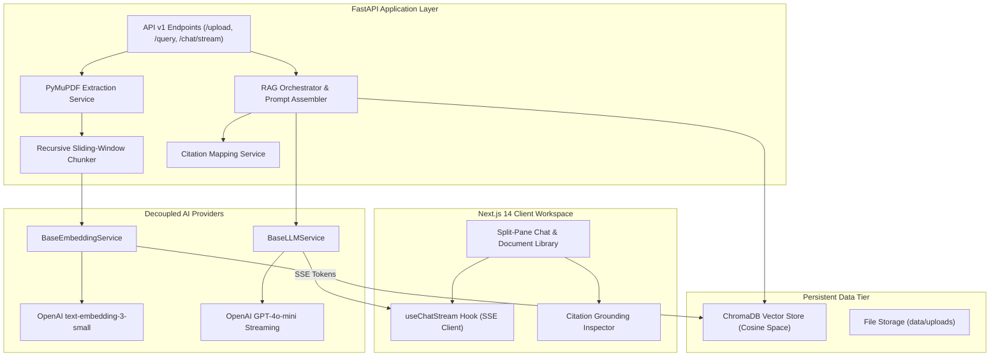

# AI Document Chat (RAG) 🚀

[](https://nextjs.org/)
[](https://react.dev/)
[](https://www.typescriptlang.org/)
[](https://tailwindcss.com/)
[](https://fastapi.tiangolo.com/)
[](https://www.python.org/)
[](https://www.trychroma.com/)
[](https://openai.com/)
[](https://docs.pytest.org/)
[](https://www.docker.com/)

A production-grade, full-stack **Retrieval-Augmented Generation (RAG)** system designed to ingest, chunk, embed, and semantically query multi-page PDF documents. Features an interactive Next.js 14 split-pane workspace, low-latency Server-Sent Events (SSE) token streaming, and citation grounding with page-level verification.

---

## 📑 Table of Contents
- [System Overview](#-system-overview)
- [Key Features](#-key-features)
- [Architecture & Data Pipeline](#-architecture--data-pipeline)
- [Tech Stack](#-tech-stack)
- [Repository Structure](#-repository-structure)
- [Quickstart & Local Setup](#-quickstart--local-setup)
- [Docker Compose Deployment](#-docker-compose-deployment)
- [REST & Streaming API Reference](#-rest--streaming-api-reference)
- [Automated Testing Suite](#-automated-testing-suite)
- [Engineering Standards & Design Decisions](#-engineering-standards--design-decisions)
- [License](#-license)

---

## 🌟 System Overview

Standard Large Language Models struggle with knowledge boundaries and hallucinate when queried about private, domain-specific, or recently updated enterprise documents. 

**AI Document Chat (RAG)** provides an end-to-end grounded document intelligence pipeline:
1. **Ingestion**: Multi-page PDF text and metadata extraction via PyMuPDF (`fitz`).
2. **Segmentation**: Recursive sliding-window chunking preserving document page numbers and character offsets.
3. **Vector Indexing**: High-dimensional vector embeddings stored in a persistent ChromaDB instance with cosine similarity metrics.
4. **Semantic Retrieval**: Scoped multi-document querying with score thresholding.
5. **Grounded Synthesis**: Anti-hallucination prompt boundaries combined with real-time SSE token streaming and verifiable page citations.

---

## ✨ Key Features

- 📄 **Page-Aware PDF Ingestion**: Extracts text page-by-page using PyMuPDF, tracking total characters, words, and document layout metadata.
- ✂️ **Sliding-Window Recursive Chunking**: Segments text along natural paragraph and sentence boundaries with configurable overlap (`CHUNK_SIZE = 1000`, `CHUNK_OVERLAP = 150`) to avoid context truncation.
- 🧠 **Decoupled Provider Architecture**: Abstract base classes (`BaseEmbeddingService`, `BaseLLMService`) decouple application logic from third-party APIs, enabling drop-in local model replacement (Ollama, FastEmbed, vLLM).
- ⚡ **Persistent ChromaDB Vector Store**: Local vector storage with `$in` array query filters for simultaneous multi-document retrieval.
- 🌊 **Real-Time SSE Token Streaming**: Asynchronous token generation delivered chunk-by-chunk using `text/event-stream` for snappy conversational feedback.
- 🎯 **Verifiable Citation Inspector**: Answers include source pills linking claims to specific document names, page numbers, and passage snippets.
- 📚 **Multi-Document Corpus Management**: Query across all indexed documents simultaneously or isolate queries to specific files.
- 🎨 **Modern Dark-Mode Workspace**: 3-pane split layout built with Next.js 14 App Router, TypeScript, and Tailwind CSS.
- 🐳 **Containerized Orchestration**: Multi-stage Dockerfiles for frontend and backend with `docker-compose.yml` for unified execution.

---

## 🏛 Architecture & Data Pipeline



---

## 🛠 Tech Stack

| Layer | Technology | Purpose |
| :--- | :--- | :--- |
| **Frontend** | [Next.js 14](https://nextjs.org/) (React 19, TypeScript) | Modern split-pane workspace, App Router, responsive state management |
| **Styling** | [Tailwind CSS](https://tailwindcss.com/) | Custom dark-slate theme (`#090d16`), responsive drawer navigation |
| **Backend** | [FastAPI](https://fastapi.tiangolo.com/) (Python 3.11) | High-concurrency async web framework with Pydantic v2 validation |
| **PDF Extraction**| [PyMuPDF / fitz](https://pymupdf.readthedocs.io/) | High-speed page-by-page document parsing and text cleaning |
| **Vector DB** | [ChromaDB](https://www.trychroma.com/) | Embedded vector store with persistent cosine similarity indexing |
| **Embeddings** | OpenAI / Local Fallback | 1536-dimensional embeddings (`text-embedding-3-small`) |
| **LLM Synthesis** | OpenAI GPT-4o-mini | Anti-hallucination grounded chat synthesis with SSE streaming |
| **Testing** | [Pytest](https://docs.pytest.org/) & AnyIO / AsyncClient | Complete automated test suite covering chunking, vectors, and RAG |
| **Containerization**| Docker & Docker Compose | Multi-stage production container builds |

---

## 📂 Repository Structure

```
AI-Document-Chat-RAG/
├── docker-compose.yml          # Unified multi-container orchestration
├── .dockerignore               # Optimized Docker build context exclusions
├── .env.example                # Environment variable blueprint
├── README.md                   # Technical documentation & usage guide
├── docs/                       # Architecture & engineering guidelines
│   ├── 01_project_architect.md
│   ├── 02_code_reviewer.md
│   ├── 03_bug_fixer.md
│   ├── 04_ui_designer.md
│   ├── 05_security_auditor.md
│   └── 06_deployment_engineer.md
├── backend/                    # FastAPI Backend Service
│   ├── Dockerfile
│   ├── requirements.txt
│   ├── app/
│   │   ├── main.py             # App entrypoint, lifespan & CORS
│   │   ├── core/               # Configuration, logging & exceptions
│   │   │   ├── config.py
│   │   │   ├── logging.py
│   │   │   └── exceptions.py
│   │   ├── interfaces/         # Swappable provider abstractions
│   │   │   ├── embedding.py
│   │   │   └── llm.py
│   │   ├── models/             # Pydantic v2 schemas
│   │   │   └── schemas.py
│   │   ├── services/           # Core domain business logic
│   │   │   ├── pdf_service.py
│   │   │   ├── chunking_service.py
│   │   │   ├── embedding_service.py
│   │   │   ├── vector_store.py
│   │   │   ├── retrieval_service.py
│   │   │   ├── rag_service.py
│   │   │   └── citation_service.py
│   │   └── api/v1/             # REST & streaming endpoints
│   │       ├── api.py
│   │       └── endpoints/
│   │           ├── health.py
│   │           ├── documents.py
│   │           └── chat.py
│   └── tests/                  # Pytest automated test suite
└── frontend/                   # Next.js 14 Frontend Application
    ├── Dockerfile
    ├── package.json
    ├── next.config.ts
    ├── tailwind.config.ts
    ├── tsconfig.json
    └── src/
        ├── app/                # Layout & page entrypoints
        ├── components/         # Modular UI components
        │   ├── chat/           # ChatContainer, ChatMessage, ChatInput
        │   ├── documents/      # DocumentList, DocumentUpload, DocumentViewer
        │   └── layout/         # Header, Sidebar, CitationPill
        ├── hooks/              # Custom hooks (useChatStream, useDocuments)
        ├── lib/                # API client & utilities
        └── types/              # TypeScript interface definitions
```

---

## ⚡ Quickstart & Local Setup

### Prerequisites
- **Python**: 3.10 or 3.11+
- **Node.js**: 18.17+ or 20+
- **OpenAI API Key** (optional for local mock testing; required for live GPT-4o generation)

### 1. Clone the Repository
```bash
git clone https://github.com/Muneeb786-hub/AI-Document-Chat-RAG.git
cd AI-Document-Chat-RAG
```

### 2. Configure Environment Secrets
```bash
cp .env.example .env
```
Edit `.env` to include your OpenAI API key:
```env
OPENAI_API_KEY=sk-your-openai-key-here
```

### 3. Start Backend Server
```bash
cd backend
python3 -m venv venv
source venv/bin/activate  # On Windows: venv\Scripts\activate
pip install -r requirements.txt
uvicorn app.main:app --reload --port 8000
```
- API Health: `http://localhost:8000/api/v1/health`
- Swagger UI Docs: `http://localhost:8000/docs`

### 4. Start Frontend Application
In a separate terminal:
```bash
cd frontend
npm install
npm run dev -p 3002
```
- Open the application: [http://localhost:3002](http://localhost:3002)

---

## 🐳 Docker Compose Deployment

To build and run both services in an isolated containerized environment:

```bash
docker compose up --build
```

- **Frontend App**: `http://localhost:3002`
- **Backend API**: `http://localhost:8000`
- **Persistent Volumes**: `./data/chroma_db` and `./data/uploads` automatically mount to named Docker volumes.

To shut down:
```bash
docker compose down
```

---

## 📡 REST & Streaming API Reference

### Document Management
| Method | Endpoint | Description |
| :--- | :--- | :--- |
| `POST` | `/api/v1/documents/upload` | Upload PDF file, extract text, segment chunks, and index vectors in ChromaDB |
| `GET` | `/api/v1/documents` | List all indexed documents with page counts and chunk statistics |
| `GET` | `/api/v1/documents/{doc_id}/chunks` | Inspect raw text chunks and page numbers for a document |
| `DELETE`| `/api/v1/documents/{doc_id}` | Delete PDF file from disk and purge vector embeddings from ChromaDB |

### Semantic Retrieval & RAG Chat
| Method | Endpoint | Description |
| :--- | :--- | :--- |
| `POST` | `/api/v1/documents/query` | Execute top-$k$ semantic similarity search across document corpus |
| `POST` | `/api/v1/chat/stream` | Stream grounded RAG responses token-by-token via Server-Sent Events (SSE) |
| `POST` | `/api/v1/chat/query` | Synchronous RAG endpoint returning full answer, citations, and source chunks |

#### Example: Chat Stream Request (`POST /api/v1/chat/stream`)
```json
{
  "query": "What are the primary findings in the uploaded quarterly report?",
  "document_ids": ["e4a9e2d7-31b1-4bc6-bf75-0e1234567890"],
  "top_k": 4
}
```

#### SSE Stream Events:
```http
data: {"citations": [{"id": "cit_1", "doc_name": "report.pdf", "page_number": 3, "snippet": "Revenue grew by 24%..."}]}

data: {"token": "Based "}
data: {"token": "on "}
data: {"token": "the "}
data: {"token": "report..."}

data: [DONE]
```

---

## 🧪 Automated Testing Suite

The backend includes a comprehensive async test suite covering all services and API routes:

```bash
cd backend
source venv/bin/activate
pytest -v tests/
```

### Test Coverage Highlights:
- `test_health.py`: Liveness and readiness probe verification.
- `test_pdf_extraction.py`: Page-by-page text parsing, character counting, and upload endpoint validation.
- `test_chunking_and_vectors.py`: Recursive overlap chunking, vector dimension checks, and ChromaDB upsert/query.
- `test_retrieval.py`: Cosine similarity search, threshold filtering, and cited context formatting.
- `test_rag_pipeline.py`: Grounded prompt assembly, async token streaming, and SSE wire protocol.
- `test_citations.py`: Citation deduplication, word-boundary snippet clipping, and page attribution.
- `test_multi_document.py`: Multi-document corpus querying, cross-document synthesis, and vector purge isolation.

---

## 📐 Engineering Standards & Design Decisions

1. **Separation of Concerns**: Route handlers perform only input validation and serialization. All heavy operations (PDF parsing, chunking, embeddings, vector queries) live inside isolated service classes.
2. **Strict Anti-Hallucination Grounding**: System prompts explicitly constrain answers to retrieved context passages. If context is insufficient, the system explicitly reports missing information rather than speculating.
3. **Traceability**: Every generated answer is paired with exact document filenames and page numbers, enabling instant human verification.
4. **Resilient Fallback Mode**: If an OpenAI API key is not supplied, the backend uses deterministic normalized vector generation and synthesis algorithms, ensuring full test suites run offline without third-party network dependencies.

---

## 📄 License

Distributed under the MIT License. See `LICENSE` for more information.
